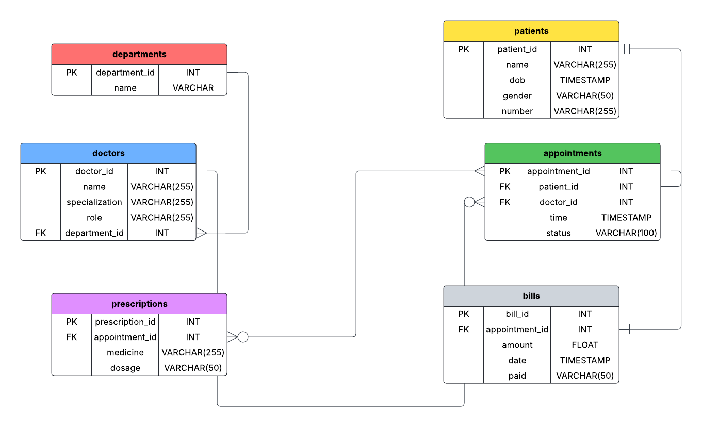

# Hospital Database Migration & Automation Project

This repository contains the complete solution for building and migrating a robust, relational database for a hospital. The project addresses the challenge of moving from an inefficient, error-prone Excel-based system to a scalable, high-integrity PostgreSQL database.

The core of this project is a single, automated SQL script that handles the entire data migration process, demonstrating a real-world ETL (Extract, Transform, Load) workflow.

---

## 📊 Database Schema (ERD)

The final database is normalized into seven interconnected tables, ensuring data integrity and minimizing redundancy. The schema is designed to manage all core hospital functionalities, including departments, doctors, patients, appointments, and billing.




For the complete table structure and relationships, see the `schema.sql` file.

---

## 🛠️ Tech Stack

-   **Database**: PostgreSQL
-   **Containerization**: Docker
-   **Scripting**: SQL

---

## ⚙️ Setup and Usage

Follow these steps to set up the database and run the automated data migration.

### 1. Prerequisites

-   You must have **Docker** installed and running on your system.
-   You need the `hospital_data.csv` file for the migration.

### 2. Project Setup

**Clone the Repository:**
```bash
git clone https://github.com/priyadarshi2022-max/Hospital-Database-Migration-Automation-Project.git
cd Hospita-Database-Migration-Automation-Project
```

**Place the Data File:**
Create a folder named `hospitalData` inside the `Project-2` directory. Place your `hospital_data.csv` file inside this new folder. The final path should be:
`./Project-2/hospitalData/hospital_data.csv`

### 3. Running the Database

**Create and Run the Docker Container:**
Open your terminal and run the following command. This will create a PostgreSQL container named `hospital-db` and link your data folder to it.
**Important**: Replace `your_strong_password_here` with a secure password.

```bash
docker run --name hospital-db -e POSTGRES_PASSWORD=your_strong_password_here -d -p 5432:5432 -v "$(pwd)/Project-2/hospitalData":/data postgres
```

**Connect to the Container:**
```bash
docker exec -it hospital-db bash
```

**Connect to PostgreSQL:**
```bash
psql -U postgres
```

**Create the Database:**
```sql
CREATE DATABASE "HospitalDB";
\c "HospitalDB"
```

### 4. Running the Automated Migration

Execute the main migration script from the `psql` prompt using the `\i` command. This single command will create the schema, load the raw data, transform and migrate it into the final tables, and clean up afterwards.

```sql
\i /data/migrate_data.sql
```

### 5. Verification

After the script finishes, your database will be fully populated. You can verify this by running a few simple queries:

```sql
SELECT * FROM doctors LIMIT 5;

SELECT * FROM appointments WHERE status = 'Completed' LIMIT 5;
```
